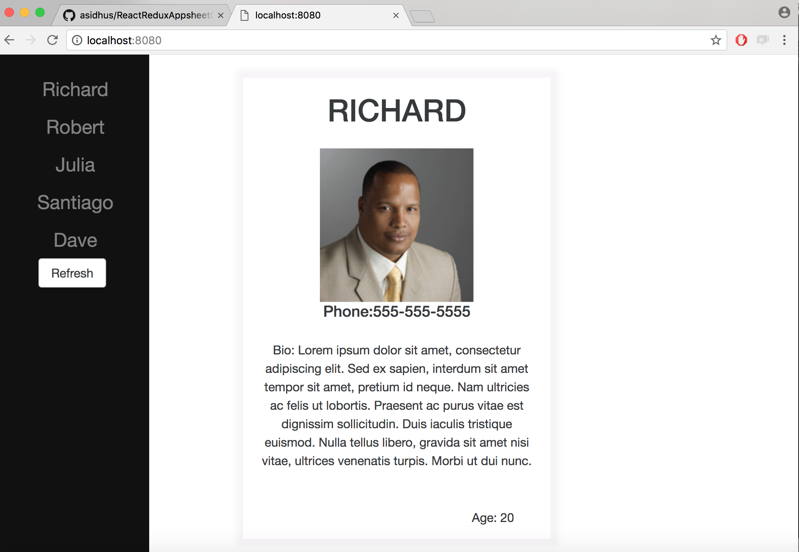

# ReduxSimpleStarter

### Getting Started

There are two methods for getting started with this repo.

#### Familiar with Git?
Checkout this repo, install dependencies, then start the process with the following:

```
> git clone https: https://github.com/asidhus/ReactReduxAppsheetChallenge.git
> cd ReduxSimpleStarter
> npm install
> npm start
```

Runs on localhost:8080

